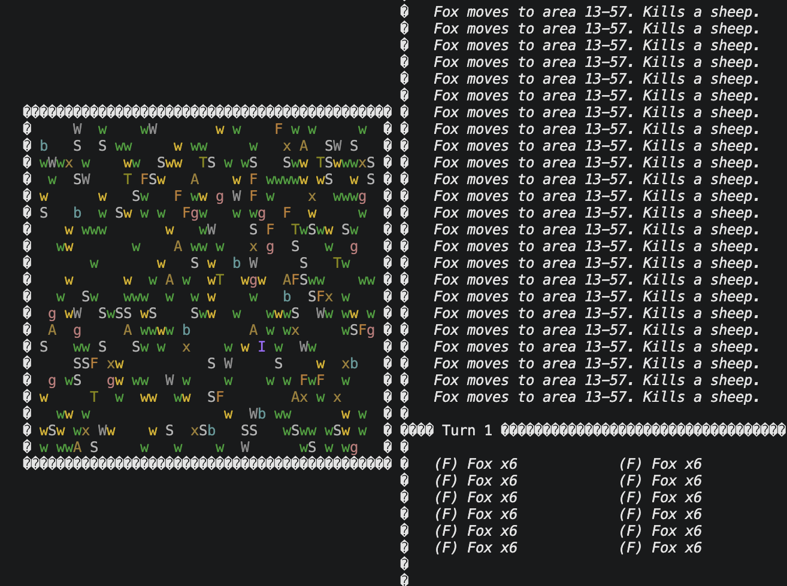

# CPP_wildlife-sim

Turn-based wildlife ecosystem simulator written in C++17 with a colored terminal UI.

C++ counterpart to the [Java version](https://github.com/mi-zuri/JAVA_wildlife-sim) and [Python version](https://github.com/mi-zuri/PY_wildlife-sim) — same simulation rules, different front-end.

---



---

## What it simulates

A 40×20 grid of organisms that act once per turn — moving, eating, reproducing, fighting, and dying.

**Animals:** Wolf, Fox, Sheep, Antelope, Tortoise, Human
**Plants:** Grass, Dandelion, Guarana, Belladonna, Sosnowsky's Hogweed

Each species has distinct strength, speed, and collision behavior. The Human is player-controlled and has a single-use special ability.

## Differences from the Java version

- Keyboard-driven terminal UI (no Swing / no mouse) with ANSI color output
- Wider world (40×20 vs 20×20)
- `std::shared_ptr<Organism>` for lifetime management
- Windows-console targeted (uses `windows.h` for cursor / color control) — no save/load

## Run

Build directly on macOS or Linux:

```bash
clang++ -std=c++17 *.cpp -o wildlife-sim
./wildlife-sim
```

If you prefer CMake and have it installed:

## Build

```bash
cmake -S . -B build
cmake --build build
./build/PO_WildlifeSimulator
```

## Controls

- Arrow keys: move the Human
- Space: advance one turn
- Tab: show info screen
- q: quit
